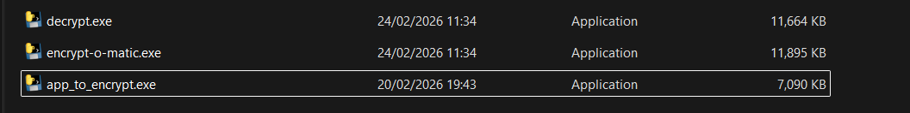
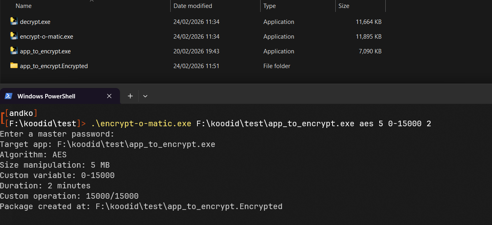
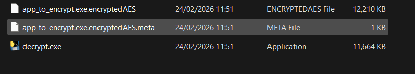
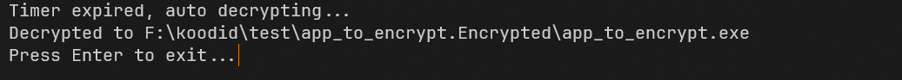
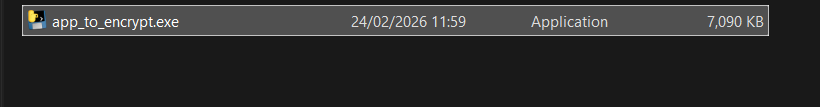

# encrypt-o-matic

This is a Windows application that lets anyone encrypt files using AES, ChaCha20 and Twofish for the specified duration.

## Features
* Multiple encryption algorithms
* PBKDF key derivation
* Integrity of the original file after decryption
* Timed encryption

## Prerequisites

* Python 3.13.*+
* Windows operating system

## Installation

1. Clone the repository 
```bash
git clone https://gitea.kood.tech/andreskozelkov/encrypt-o-matic.git

cd encrypt-o-matic
```

2. Create a virtual environment and install dependencies
```bash
python -m venv .venv

pip install -r requirements.txt
```

3. Compile the code into encrypt-o-matic.exe and decrypt.exe \
*Note: both .exe files have to be in the same directory to work.*
```bash
.\build.bat
```

4. Run the app from cmd or powershell
```bash
.\encrypt-o-matic.exe --help
```

5. Also can be ran after compiling with
```bash
python main.py --help
```

## Usage
### Arguments
```bash
.\encrypt-o-matic.exe <target_app> <encryption_algorithm> <size_manipulation> <custom_variable> <duration>
```

**target_app** - Path to file, *example: F:\koodid\test\test.exe* \
**encryption_algorithm** - Choice between AES, ChaCha20 and TwoFish algorithms \
**size_manipulation** - Inflate the encrypted file by specified amount of MB \
**custom_variable** - Perform a custom time-consuming operation before encrypting the file, *example: range 0-10000 with each incrementation taking 0.001 s*\
**duration** - How long will the file stay encrypted for in minutes

### Encryption:
1. Find a file you want to encrypt


2. From command shell run encrypt-o-matic with any settings

The app will prompt for a master password

3. The app will create a folder with encrypted file contents and copied decrypt.exe


### Decryption

1. Running decrypt.exe before the encryption timer is up will ask the user for a password


2. Running decrypt.exe after the encryption timer is up will decrypt the file and delete encrypted files.





